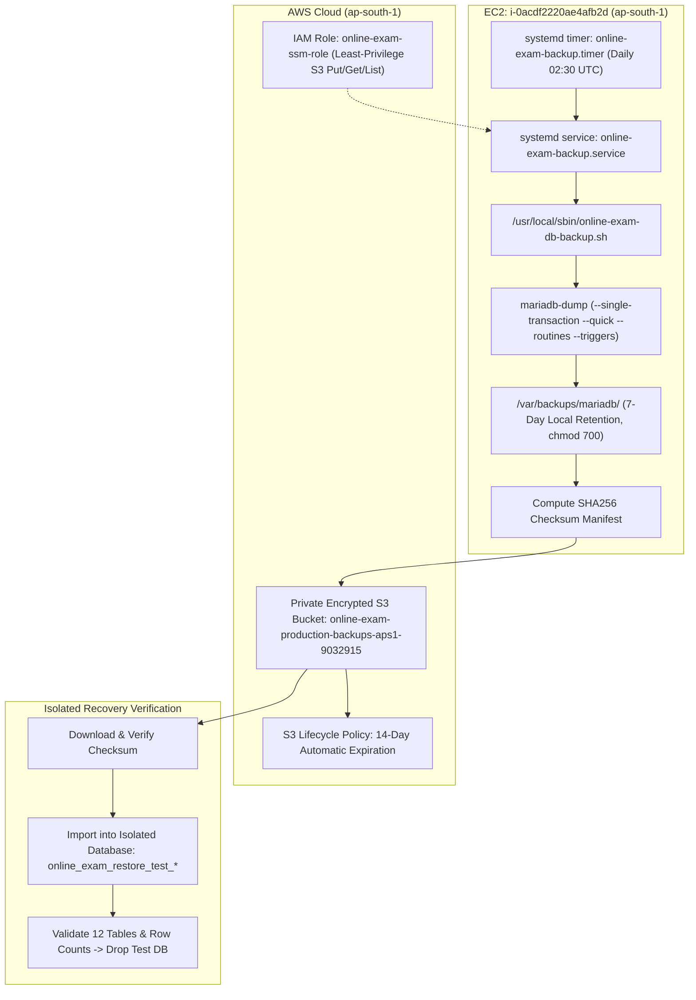

# AWS Production Backup, Recovery & Disaster-Readiness Skill

This skill defines the operational standards, automated scripts, systemd units, least-privilege IAM policies, and step-by-step disaster recovery procedures for the **Online Exam System** on Amazon Web Services (AWS).

---

## 1. Architecture & Operational Topology



### Key Parameters:
* **Target EC2 Instance**: `i-0acdf2220ae4afb2d` (`online-exam-production` in `ap-south-1`)
* **Target Database**: `online_exam_db` (MariaDB 10.5+, loopback `127.0.0.1:3306`)
* **Local Backup Directory**: `/var/backups/mariadb/` (Permissions `chmod 700`, owner `root:root`)
* **Local Retention**: 7 days (auto-pruned by script; oldest pruned only when new backup succeeds)
* **S3 Backup Bucket**: `online-exam-production-backups-aps1-9032915` (Region: `ap-south-1`)
* **S3 Security**: Block Public Access 100% enabled; AES256 SSE-S3 encryption at rest
* **S3 Retention**: 14 days (enforced via AWS S3 Lifecycle Rule `ExpireBackupsAfter14Days`)
* **Backup Schedule**: Daily at 02:30:00 UTC (08:00 AM IST) via `online-exam-backup.timer`
* **EC2 IAM Role**: `online-exam-ssm-role` with inline policy `OnlineExamBackupS3Access`

---

## 2. Inviolable Safety & Security Rules

1. **Zero Secret Exposure**: Passwords, tokens, and AWS access keys are NEVER hardcoded, logged, printed to stdout/stderr, or stored in git.
2. **Local Socket Authentication**: The backup script executes as `root` using local UNIX socket authentication (`mariadb-dump`). No database password is required or passed in process arguments.
3. **Transactional Non-Blocking Dumps**: Uses `--single-transaction --quick --routines --triggers --no-tablespaces`. InnoDB tables are dumped inside a consistent transaction without table locks, allowing live examination activity to proceed uninterrupted.
4. **Isolated Restore Gate**: Automated recovery tests **STRICTLY REFUSE** to restore into `online_exam_db`. Tests use isolated temporary databases (`online_exam_restore_test_<timestamp>`) and drop them immediately upon verification.
5. **Human Authorization for Production Restore**: Automated scripts **NEVER** automatically perform production restores. Any live production database restoration requires explicit administrator authorization.
6. **Disk Space Guard**: The script verifies that at least 500 MB of free disk space exists before initiating a dump.

---

## 3. Component Reference

| Component | Path / Identifier | Description |
| :--- | :--- | :--- |
| **Backup Script** | `/usr/local/sbin/online-exam-db-backup.sh` | Main backup executor: dump, gzip, sha256, S3 upload, local pruning |
| **Restore Test Tool**| `/usr/local/sbin/restore-test.sh` | Automated verification tool for local or S3 backups |
| **Systemd Service** | `/etc/systemd/system/online-exam-backup.service` | Oneshot systemd unit executing backup script |
| **Systemd Timer** | `/etc/systemd/system/online-exam-backup.timer` | Daily schedule triggering backup service |
| **IAM Policy** | `OnlineExamBackupS3Access` | Scoped Put/Get/List permissions on S3 backup prefix |
| **Lock File** | `/var/run/online-exam-backup.lock` | Atomic file lock preventing concurrent executions |

---

## 4. Operational Runbook & Commands

### A. Manual Backup Execution (via AWS SSM)
To trigger an immediate on-demand backup outside the daily schedule:
```bash
# Via SSM Run Command or SSH-less EC2 console:
sudo /usr/local/sbin/online-exam-db-backup.sh
```

### B. Inspect Backup Logs & Timer Status
```bash
# Check systemd timer schedule
systemctl status online-exam-backup.timer
systemctl list-timers online-exam-backup.timer

# View latest backup execution logs
journalctl -u online-exam-backup.service -n 50 --no-pager
```

### C. List Backups in Local Storage & S3
```bash
# Local backups
ls -la /var/backups/mariadb/

# S3 backups
aws s3 ls s3://online-exam-production-backups-aps1-9032915/online-exam/mariadb/ --recursive --human-readable --region ap-south-1
```

### D. Run an Isolated Restore Verification
```bash
# Test local archive
sudo /usr/local/sbin/restore-test.sh /var/backups/mariadb/online_exam_db_<timestamp>.sql.gz

# Test S3 archive (downloads, verifies checksum, tests restore, cleans up)
sudo /usr/local/sbin/restore-test.sh s3://online-exam-production-backups-aps1-9032915/online-exam/mariadb/2026/09/19/online_exam_db_<timestamp>.sql.gz
```

---

## 5. Production Disaster Recovery Decision Tree

```
Incident Occurs
  │
  ├─► [Scenario A: Database Table Corruption or Erroneous Data Deletion]
  │     1. Put application into maintenance mode (systemctl stop php-fpm).
  │     2. Identify latest verified backup in S3 or /var/backups/mariadb/.
  │     3. Take emergency safety dump: mariadb-dump online_exam_db > /var/backups/emergency_before_restore.sql
  │     4. Decompress and restore: zcat <backup>.sql.gz | mariadb online_exam_db
  │     5. Verify row counts and integrity: mariadb online_exam_db -e "SHOW TABLES; SELECT COUNT(*) FROM results;"
  │     6. Restart PHP-FPM: systemctl start php-fpm
  │
  ├─► [Scenario B: Complete EC2 Instance Loss / Hardware Failure]
  │     1. Launch replacement EC2 instance (Amazon Linux 2023, ap-south-1).
  │     2. Attach IAM role 'online-exam-ssm-role' and security group 'online-exam-sg'.
  │     3. Reassociate Elastic IP 13.202.114.100 to new instance.
  │     4. Install stack: Nginx, PHP-FPM, MariaDB, certbot.
  │     5. Pull latest code from GitHub main to /var/www/online-exam.
  │     6. Download latest backup from S3: aws s3 cp s3://online-exam-production-backups-aps1-9032915/.../latest.sql.gz .
  │     7. Create and restore database: mariadb -e "CREATE DATABASE online_exam_db;" && zcat latest.sql.gz | mariadb online_exam_db
  │     8. Deploy config.local.php with secure generated DB password.
  │     9. Start Nginx, PHP-FPM, MariaDB, and online-exam-finalizer.timer.
  │
  └─► [Scenario C: Erroneous Application Deployment with No Schema Changes]
        1. Use aws-production-deploy automatic rollback:
           .\.agents\skills\aws-production-deploy\scripts\deploy.ps1 -Rollback
```
